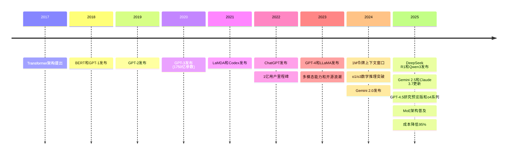
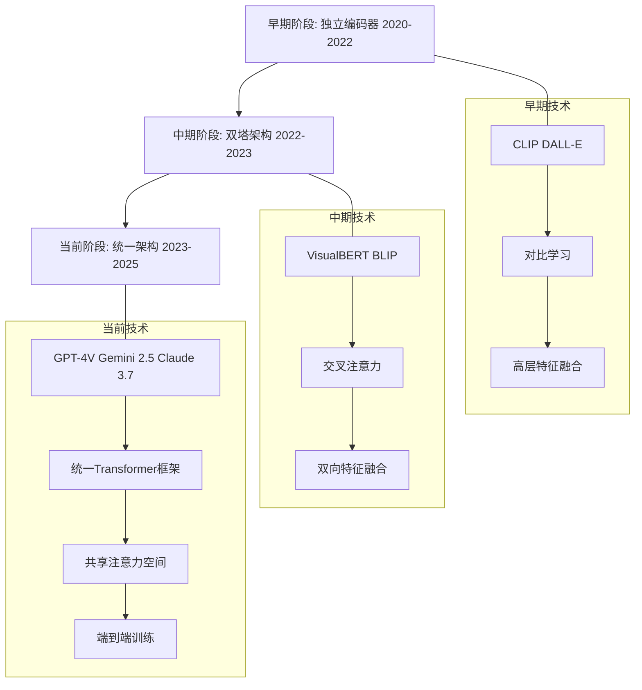
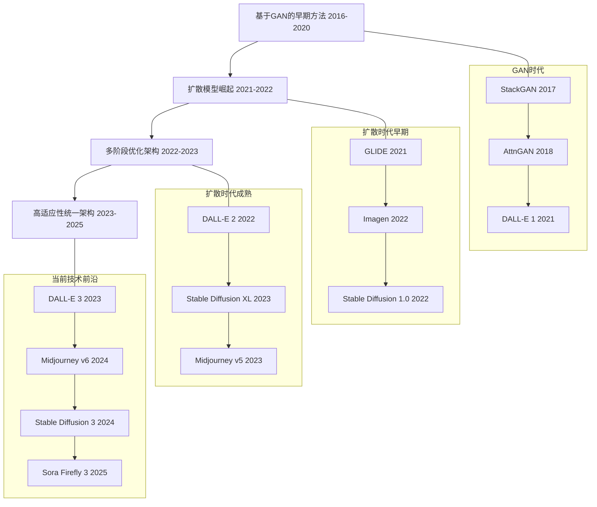
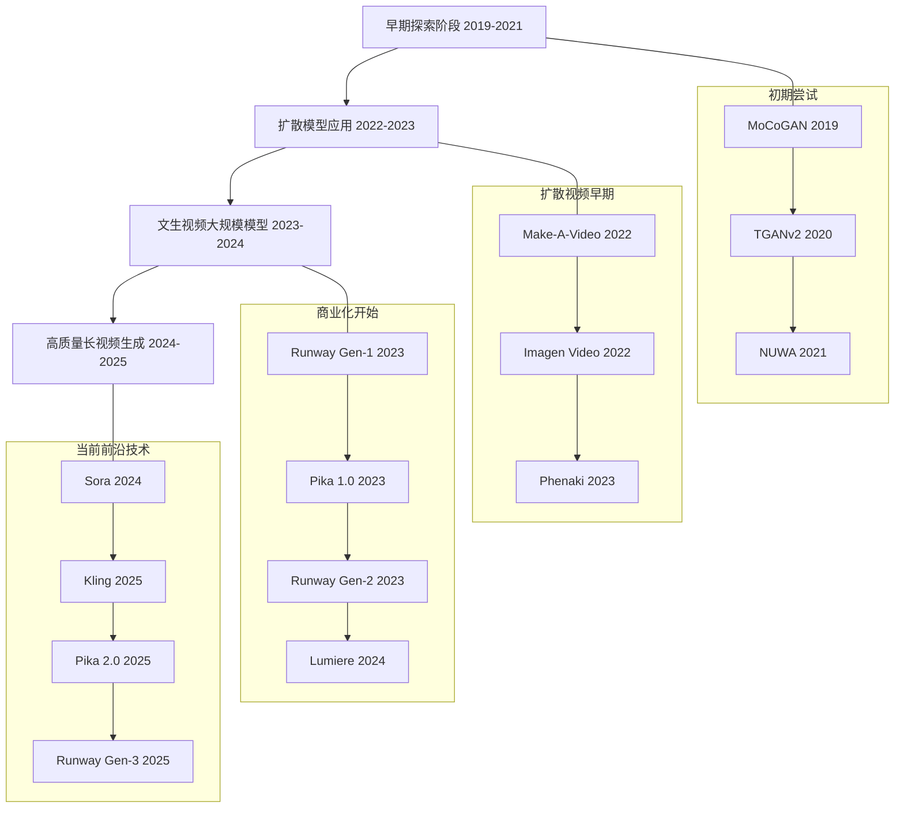
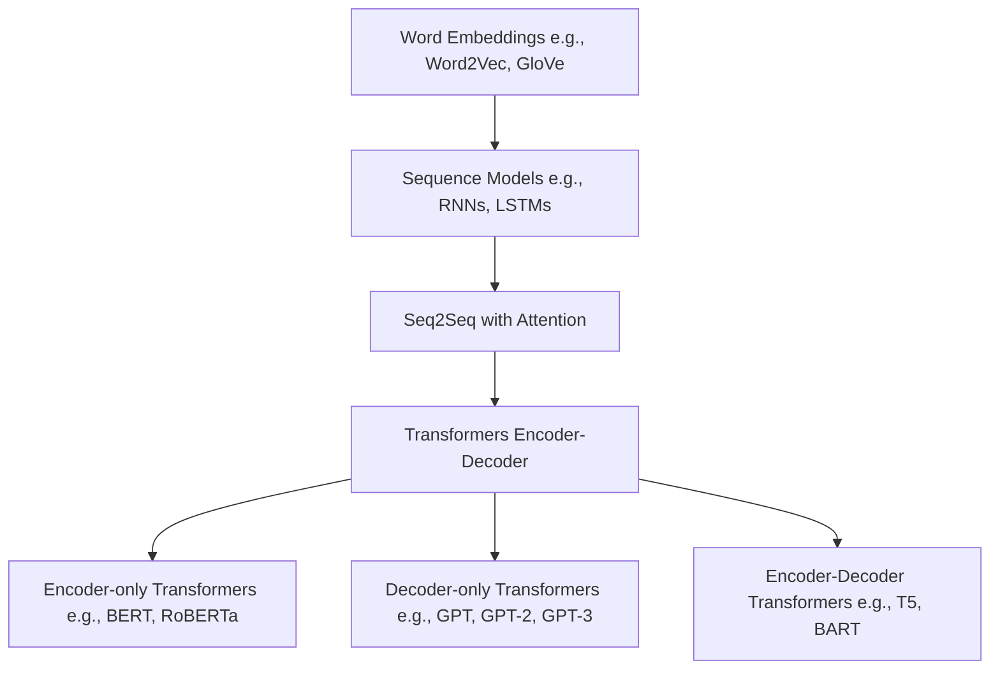
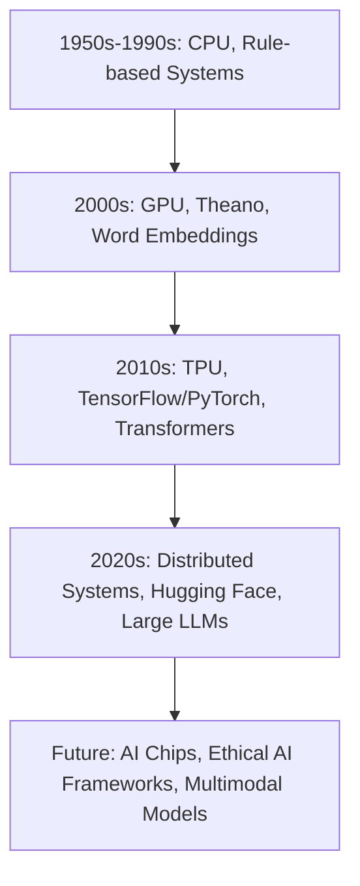

# 大语言模型的发展与应用综述

## 目录

1. [引言](#引言)
2. [大语言模型的类型分类](#大语言模型的类型分类)
3. [关键发展节点](#关键发展节点)
4. [细分领域应用](#细分领域应用)
5. [多模态大语言模型的技术路线与应用](#多模态大语言模型的技术路线与应用)
6. [生成式多模态AI的演进](#生成式多模态ai的演进)
7. [大模型驱动的生产力变革](#大模型驱动的生产力变革)
8. [智能体与基础设施](#智能体与基础设施)
9. [国际竞争格局](#国际竞争格局)
10. [技术流派演进](#技术流派演进)
11. [计算硬件与开发框架的发展史](#计算硬件与开发框架的发展史)
12. [Retrieval-Augmented Generation（RAG）的发展与应用](#retrieval-augmented-generationrag的发展与应用)
13. [商业角度的热点技术与未来发展](#商业角度的热点技术与未来发展)
14. [学术研究方向与就业指导](#学术研究方向与就业指导)
15. [结论](#结论)
16. [关键引文](#关键引文)
17. [附录1:大语言模型应用扩充研究](大语言模型应用扩充研究.md)
17. [附录2:百度大模型产品与技术生态](百度大模型产品与技术生态.md)

## 引言

### 概述
大语言模型（Large Language Models, LLMs）是人工智能领域近年来最具突破性的技术之一。自2022年ChatGPT的发布以来，LLM已从学术研究扩展到广泛的商业应用，深刻影响了从日常对话到专业领域的多个方面。研究表明，LLM通过处理海量文本数据，能够生成类人文本、回答复杂问题并执行多样化任务。然而，其发展也伴随着计算成本、模型偏见和数据隐私等争议。本文旨在整合近期研究内容，全面回顾LLM的类型分类、发展历程、应用场景、相关技术演进、商业趋势以及学术研究方向，为读者提供一个结构化的综述。

LLM技术革命并非突然出现，而是基于几十年的自然语言处理（NLP）研究积累。从早期的规则系统到统计方法，再到神经网络和Transformer架构，NLP技术的演进为LLM奠定了坚实基础。2017年Google发表的《Attention Is All You Need》论文引入Transformer架构，成为LLM技术突破的关键转折点。这一架构的自注意力机制能有效捕捉长距离依赖关系，使模型可以理解更复杂的语言结构和语义关联。

LLM的发展推动了人工智能研究范式的转变，从传统的"预训练-微调"转向更强调规模和通用性的"预训练-提示"模式。这一转变不仅提高了模型性能，也降低了特定应用的开发门槛，使AI技术更加普及和民主化。同时，LLM引发了关于计算资源分配、数据隐私保护和模型偏见等议题的广泛讨论，这些议题对AI技术的可持续发展至关重要。

### 结论
LLM的快速发展标志着人工智能进入新阶段，其影响力和潜力仍在不断扩展。本文将通过详细分析，揭示LLM如何塑造技术与社会。

## 大语言模型的类型分类

### 引言
大语言模型根据其设计目标和功能，可分为多种类型，每类代表独特的技术方向和应用潜力。研究表明，这些分类反映了LLM在通用性、开放性、多模态能力、推理能力和效率等方面的差异。

### 分类与代表模型
以下是LLM的主要类型及其特点：

1. **通用大语言模型（General-Purpose LLMs）**  
   - **特点**：设计用于广泛的自然语言处理任务，如对话生成、文本总结和问答系统。
   - **技术细节**：通常采用自回归解码器架构，基于超大规模语料库预训练，使用RLHF（人类反馈强化学习）进行对齐，具有强大的零样本和少样本学习能力。
   - **代表模型**：  
     - **GPT-4.5与ChatGPT深度研究（OpenAI）**：2025年发布的GPT-4.5研究预览版支持深度研究功能，与多种推理模型（o4-mini、o4-mini-high和o3）集成，上下文窗口达200K令牌。深度研究功能允许自主执行复杂研究任务，进行多步骤推理和事实求证。图像理解能力提升至32K分辨率，支持复杂视觉分析和图表解读。
     - **Claude 3.7 Sonnet（Anthropic）**：支持200K令牌上下文窗口，提供"扩展思考模式"增强推理能力，在数学和推理任务上表现出色。新增网页搜索能力和智能体功能，支持专业编码工具，内置文件分析能力，广泛应用于企业客户支持和内容生成。
     - **Gemini 2.5（Google DeepMind）**：支持1M令牌上下文窗口，内置工具使用能力，集成于Google Workspace，适用于复杂文档分析和学术研究。新增"深度研究"功能，能够自主执行多步骤研究任务，进行深度事实分析和数据收集。
     - **Grok 3（xAI）**：集成于X平台，具有实时网络访问能力，注重速度和幽默风格，主要应用于新闻分析和编码辅助。增加"深度研究"能力，支持多轮复杂查询分析，提供数据可视化和互动图表功能。

2. **开源/源可用大语言模型（Open-Source/Accessible LLMs）**  
   - **特点**：通过开放访问促进研究合作，降低开发门槛，常采用Apache 2.0或MIT许可。
   - **技术细节**：通常提供多种参数规模版本（从1B到175B不等），支持部署优化和硬件适配，接受社区贡献改进。
   - **代表模型**：  
     - **Qwen3（阿里巴巴）**：Qwen3系列包括从1.5B到72B的不同规模模型，Qwen3-Max采用MoE（混合专家）架构，基于25T令牌训练集，支持100K令牌上下文。在MMLU和GSM8K等测试集上表现卓越，擅长中英双语任务，广泛应用于阿里云和开源社区。
     - **LlaMA（Meta）**：LLaMA 3系列提供8B至70B参数版本，支持128K令牌上下文，采用分组查询注意力机制提高处理效率。在多语言表现上有明显提升，特别是欧洲语言支持，被超过2000个开源项目采用和调优。
     - **Mistral AI模型**：Mistral Large 3（24B参数）采用滑动窗口注意力机制，实现150令牌/秒的生成速度，是同等规模模型中最快的。专为资源高效设计，支持量化至4位精度而保持性能，已成为API和边缘设备部署的首选。

3. **多模态大语言模型（Multimodal LLMs）**  
   - **特点**：能处理文本、图像、音频等多种数据类型，扩展了应用场景。
   - **技术细节**：通常使用专门的编码器处理非文本数据，如用于图像的Vision Transformer (ViT)，通过投影层将不同模态特征映射到统一的表示空间。
   - **代表模型**：  
     - **GPT-4V（OpenAI）**：支持高分辨率图像分析（32K像素），能理解复杂图表和专业图像，集成OCR识别文档文本，在医学影像和数据可视化分析上表现突出。
     - **Gemini Pro Vision（Google DeepMind）**：支持长视频理解（最长30分钟），能分析时序关系和动态场景，特别适合教育和内容审核场景，已应用于YouTube视频摘要生成。
     - **Pixtral 16B（Mistral AI）**：采用轻量级双通道架构，平衡性能和效率，支持实时图像分析，适合移动设备部署，已在零售和安防领域应用。

4. **推理聚焦大语言模型（Reasoning-Focused LLMs）**  
   - **特点**：优化用于复杂逻辑任务，如数学、科学研究和编程，需更多计算资源。
   - **技术细节**：通常采用思维链（Chain-of-Thought）、自我验证和迭代推理技术，注重中间推理步骤的准确性，使用特殊的推理数据集进行微调。
   - **代表模型**：  
     - **OpenAI o3/o4系列**：o3在国际数学奥林匹克资格考试中达到83%准确率，新推出的o4-mini和o4-mini-high针对不同复杂度的推理任务进行优化，计算效率提升30%。采用多智能体系统进行验证和迭代，在Stanford MATH数据集上达到95.2%的准确率。已应用于科研和金融建模，支持复杂决策分析。
     - **DeepSeek R1**：671亿参数，采用稀疏MoE架构，实现与o1相当的推理能力，同时成本低95%。在物理学和化学领域表现特别突出，已协助多个研究团队发现新材料特性。每一步推理都包含自我验证机制，显著减少了错误累积。

5. **效率导向大语言模型（Efficiency-Oriented LLMs）**  
   - **特点**：注重计算效率和成本效益，适合资源受限环境。
   - **技术细节**：采用参数共享、知识蒸馏、混合精度训练等技术，优化推理延迟和吞吐量，支持边缘设备部署。
   - **代表模型**：  
     - **Mistral Small 3**：24B参数，采用分组查询注意力和旋转位置编码，实现低延迟（150令牌/秒），支持量化到6位精度，在4GB显存设备上可运行。已应用于客服聊天机器人和移动应用，实现实时响应。
     - **DeepSeek MoE**：671B MoE模型，每令牌仅激活37B参数（约5.5%），通过动态路由算法选择最相关专家，比同等性能的密集模型节省95%计算资源。在企业级部署中显著降低了运营成本，使更多公司能负担AI技术。

以下表格总结了2025年部分顶级模型的关键特征：

| 模型           | 开发者       | 参数范围       | 上下文窗口     | 关键特征                                                              |
|---------------|--------------|----------------|-----------------|-------------------------------------------------------------------------|
| GPT-4.5       | OpenAI       | 未公开         | 200K            | 研究预览版，深度研究功能，多种推理模型(o4系列)，32K分辨率视觉处理      |
| Claude 3.7    | Anthropic    | 未公开         | 200K            | 扩展思考模式，网页搜索，智能体功能，编码工具，文档处理优化              |
| Gemini 2.5    | Google       | 未公开         | 1M              | 超长上下文，深度研究功能，工具使用能力，复杂文档分析和学术研究优化      |
| Grok 3        | xAI          | 未公开         | 128K            | 实时网络访问，深度研究功能，数据可视化，新闻分析和编码能力强           |
| DeepSeek R1   | DeepSeek     | 671B (MoE)     | 128K            | 稀疏激活，自我验证推理，开源，数学推理能力强                           |
| Qwen3-Max     | 阿里巴巴      | 72B (MoE)      | 100K            | 混合专家架构，25T令牌训练，开源，中英双语优化                           |
| LlaMA 3-70B   | Meta         | 70B            | 128K            | 开源，分组查询注意力机制，多语言支持，社区适配广泛                     |
| Mistral 3     | Mistral AI   | 24B-120B       | 64K-128K        | 高速生成（150令牌/秒），资源效率，边缘设备支持                          |

### 技术对比分析

不同类型的LLM在技术实现上存在明显差异，影响其应用场景和实用性：

1. **参数效率与规模**
   - 通用模型通常采用密集参数架构，如GPT-4o和Claude系列
   - 高效模型和部分大规模模型采用MoE架构，如Qwen3-Max和DeepSeek R1
   - MoE模型激活率通常在5%-15%之间，显著降低计算需求

2. **上下文窗口策略**
   - Gemini 2.5的1M窗口采用分层注意力机制，先处理局部上下文再整合全局信息
   - Claude采用压缩记忆技术，对早期上下文进行摘要和关键信息提取
   - LLaMA 3系列使用旋转位置编码提高长序列建模能力

3. **推理与生成速度**
   - Mistral模型优化了解码器结构，实现高吞吐量
   - GPT-4o使用硬件感知算法和优化器减少延迟
   - 效率导向模型通常支持量化技术，降低内存需求

4. **多语言与领域适应**
   - Qwen3特别优化中英双语能力，在中文语料上训练比例高
   - LLaMA 3增强了多语言支持，特别是欧洲语言
   - 专业领域模型通常进行领域特定数据微调

### 结论
LLM的类型分类反映了其在功能和应用上的多样性。通用模型提供了广泛的适用性，开源模型促进了研究合作，多模态模型扩展了数据处理能力，推理模型和效率模型则针对特定需求优化。这些分类不仅展示了当前LLM生态系统的丰富性，也指明了未来技术发展的多元化方向。随着模型架构和训练技术的进步，LLM类型间的界限可能会变得更加模糊，通往更全面、高效的人工智能系统。

## 关键发展节点

### 引言
大语言模型的发展历程充满了关键事件和突破性进展，这些节点不仅标志着技术的进步，也推动了其在实际应用中的普及。研究表明，自2022年以来，LLM的规模、能力和应用场景均取得了显著提升。

### 时间轴
以下是LLM发展的主要里程碑，详细展示从早期实验到当前成熟应用的演进：

- **2017年**：
  - Google发表《Attention Is All You Need》论文，引入Transformer架构，为LLM奠定基础
  - 该架构通过自注意力机制解决了RNN和LSTM处理长序列的局限性
  - OpenAI在此基础上开始开发GPT（Generative Pre-trained Transformer）系列模型

- **2018年**：
  - Google发布BERT（Bidirectional Encoder Representations from Transformers）
  - OpenAI发布GPT-1（1.17亿参数），展示预训练语言模型潜力
  - 这些模型将NLP任务性能提升15%-30%，引发研究热潮

- **2019年**：
  - OpenAI发布GPT-2（15亿参数），引发关于AI安全性讨论
  - Facebook发布RoBERTa，优化BERT训练方法
  - Google发布T5，统一多种NLP任务

- **2020年**：
  - OpenAI发布GPT-3（1750亿参数），展示惊人的零样本和少样本学习能力
  - Google发布Switch Transformer，首个大规模MoE模型
  - EleutherAI推出首个大型开源模型GPT-Neo

- **2021年**：
  - Anthropic成立，开始开发Constitutional AI方法
  - Google发布LaMDA对话模型
  - OpenAI推出Codex，用于代码生成
  - DeepMind发布Gopher（2800亿参数）

- **2022年**：
  - ChatGPT（基于GPT-3.5）发布，迅速吸引超过1亿用户，将LLM带入大众视野
  - Anthropic发布Claude，强调安全性和有益性
  - Meta发布OPT-175B开源模型
  - BLOOM（1760亿参数）发布，支持46种语言
  - Stability AI发布Stable Diffusion，掀起生成式AI热潮

- **2023年**：
  - OpenAI发布GPT-4，引入多模态能力（文本和图像处理）
  - Google发布Bard和PaLM 2
  - Meta发布LLaMA开源模型，推动社区创新
  - Anthropic发布Claude 2
  - Mistral AI成立并发布Mistral 7B开源模型
  - 谷歌发布Gemini，整合多模态能力
  - 上下文窗口从2K扩展到32K，突破长文本处理限制

- **2024年**：
  - OpenAI发布o1模型，专注数学和推理能力
  - Google Gemini 1.5支持1M令牌上下文窗口，创历史新高
  - Anthropic的Claude 3系列发布，包括Haiku、Sonnet和Opus三种规格
  - OpenAI推出GPT-4o，整合文本、图像和音频处理
  - Meta发布LLaMA 3开源模型
  - Claude 2.1支持200K令牌上下文
  - OpenAI推出o3模型，在国际数学奥林匹克资格考试中达到83%准确率
  - 令牌处理速度提升300%，模型部署成本降低60%
  - Inflection AI发布Pi 2.5，优化个人助手体验
  - Google发布Gemini 2.0，增强跨模态理解能力和推理深度

- **2025年（截至5月）**：
  - DeepSeek发布DeepSeek R1，671亿参数MoE架构，推理能力与OpenAI o1相当，成本低95%
  - 阿里巴巴推出Qwen3系列，包括Qwen3-Mini（1.5B）到Qwen3-Max（72B）多个规格
  - Qwen3-Max采用稀疏激活MoE架构，25T令牌训练量，在数学和编码任务上表现卓越
  - Google推出Gemini 2.5，加入"深度研究"功能，提升自主研究能力
  - Anthropic发布Claude 3.7 Sonnet，新增网页搜索和智能体功能，支持专业编码工具
  - xAI推出Grok 3，加入深度研究能力和数据可视化功能
  - OpenAI发布GPT-4.5研究预览版，集成多个推理模型（o4-mini、o4-mini-high和o3）
  - Mistral AI发布Mistral 3系列，包括首个商业化的开源多模态模型Pixtral 16B
  - 生成速度达到150令牌/秒，大幅提升用户体验
  - 部署成本降至2022年的15%，加速商业应用普及

以下是时间轴图：

### 技术突破与影响

每个关键节点都伴随着重要的技术突破，产生了深远影响：

1. **Transformer架构（2017）**
   - **技术突破**：自注意力机制能并行处理序列，解决长依赖问题
   - **影响**：成为后续所有大型语言模型的基础架构，彻底改变NLP研究方向

2. **ChatGPT（2022）**
   - **技术突破**：RLHF（人类反馈强化学习）大幅提升对话质量
   - **影响**：在两个月内获得1亿用户，引发AI商业应用热潮，改变公众对AI的认知

3. **GPT-4与多模态（2023）**
   - **技术突破**：统一架构处理文本和图像
   - **影响**：开启AI多感官理解能力，扩展应用场景至视觉理解

4. **上下文窗口扩展（2023-2024）**
   - **技术突破**：从2K扩展到32K，再到200K，最终达到1M
   - **影响**：使LLM能处理整本书籍或长文档，大幅扩展应用场景

5. **推理能力提升（2024-2025）**
   - **技术突破**：o3/o4系列模型在数学和逻辑推理上的突破
   - **影响**：使AI在科学研究和专业领域应用成为可能，推理准确率提高至95%以上

6. **MoE架构普及（2025）**
   - **技术突破**：大规模模型仅激活小部分参数进行推理
   - **影响**：部署成本降低95%，使高性能AI更加普及化

7. **深度研究功能（2025）**
   - **技术突破**：模型具备自主执行多步骤研究的能力
   - **影响**：简化复杂信息收集和分析过程，提升AI作为研究助手的价值

### 社会与商业影响

LLM发展过程中的关键节点也带来了重要的社会和商业变革：

1. **人工智能民主化**
   - 开源模型（如LLaMA、Mistral和Qwen）降低了进入门槛
   - 中小企业和个人开发者能够部署和定制AI解决方案

2. **就业结构变化**
   - 创造了AI提示工程、LLM评估专家等新职业
   - 自动化内容生成和客户服务岗位

3. **知识获取革命**
   - 从搜索引擎到对话式AI助手的转变
   - 个性化学习和信息获取方式

4. **商业模式创新**
   - API服务模式（如OpenAI、Anthropic和Cohere的订阅服务）
   - 垂直领域专用AI解决方案（医疗、法律、金融）
   - AI辅助软件生态系统（如Cursor、Jasper和Copy.ai）

### 结论
LLM的发展速度惊人，从2017年Transformer架构的提出到2025年的大规模商业化应用，短短八年内，模型规模、能力和应用场景均实现了质的飞跃。每个里程碑都代表了重要的技术突破，推动AI从学术研究走向实际应用。随着MoE架构的普及和推理能力的提升，AI部署成本大幅降低，加速了商业应用的普及。同时，这些进展也引发了关于计算资源分配、数据隐私和伦理问题的讨论，这些挑战将伴随LLM技术进一步发展。

## 细分领域应用

### 引言
LLM在多个细分领域展现了强大潜力，从创意写作到专业领域的应用，其表现令人瞩目。研究表明，LLM在特定任务中的优势显著，但也面临原创性、准确性和领域适应的挑战。

### 应用领域
以下是LLM在细分领域的典型应用及其技术细节：

1. **诗词创作与文学**  
   - **应用**：Claude 3.7和GPT-4.5生成诗歌、短篇小说和博客内容，质量可媲美人类作家。模型能够模仿特定作家风格，生成符合特定文学流派的作品。
   - **技术细节**：模型通过分析大量文学作品学习叙事结构、修辞手法和情感表达。使用Nucleus采样（p=0.92）和温度参数（t=0.8）平衡创造性和连贯性。
   - **案例**：BART-large在短篇创意写作比赛中超越平均人类作家（[arXiv:2409.11547](https://arxiv.org/abs/2409.11547)）。《纽约时报》文学评论家盲测无法准确区分AI和人类创作的短篇小说。
   - **挑战**：生成内容可能缺乏原创性或过于可预测，中间长度叙事（10,000-50,000字）的情节连贯性仍有不足。模型难以把握深层主题和象征意义，需改进输出多样性。

2. **新闻采编**  
   - **应用**：Grok 3（xAI）集成于X平台，擅长实时新闻分析，支持生成新闻稿和事实核查。模型能够综合多个消息源，提供不同视角的新闻报道。
   - **技术细节**：使用实时数据API和网络搜索工具获取最新信息，采用实体识别和事实验证管道确保准确性。专门训练数据集包含1.2M篇高质量新闻文章和相关元数据。
   - **案例**：《华盛顿邮报》使用LLM生成选举报道和体育赛事摘要，处理速度比人工快5倍。《彭博社》BloombergGPT自动生成财报分析，准确识别92%的关键财务指标变化。
   - **挑战**：需结合人工审核以确保内容准确性和避免偏见。自动生成的新闻可能缺乏深度分析和调查性报道的洞察力。模型偶尔会产生"幻觉"，引用不存在的消息源或细节。

3. **数学与逻辑推理**  
   - **应用**：DeepSeek R1和Qwen3-Max在数学推理中表现优异，OpenAI o4-mini-high在国际数学奥林匹克预选赛中达到87%准确率。这些模型能解决复杂的代数问题、几何证明和微积分习题。
   - **技术细节**：采用思维链（Chain-of-Thought）和验证-修正循环增强推理能力。DeepSeek R1引入自我验证机制，在每一步推理后检查结果合理性。模型训练使用25M高质量数学问题和详细解析。
   - **案例**：MIT研究团队使用o4系列模型辅助发现新的质数分布规律。DeepSeek R1在物理建模问题上帮助研究人员优化太阳能电池设计，提高效率7.2%。
   - **挑战**：复杂的多步骤推理仍有错误率，特别是涉及抽象概念的问题。模型可能在中间步骤正确但得出错误结论，需进一步优化推理一致性。

4. **代码生成与调试**  
   - **应用**：Claude 3.7、Gemini 2.5和Qwen3生成代码片段、调试程序，提高开发效率。模型能处理20多种编程语言，支持整个代码库的分析和重构。
   - **技术细节**：使用AST（抽象语法树）分析确保语法正确性，通过自回归生成过程构建完整功能。模型在6.2B行代码和相关文档上训练，包括GitHub公共仓库和API文档。
   - **案例**：Qwen3-Max支持128K令牌上下文，能分析整个代码库并提供重构建议。GitHub Copilot用户报告编码速度提高35%，调试时间减少42%。Replit使用Claude改进代码质量，减少29%的安全漏洞。
   - **挑战**：生成的代码可能包含安全漏洞或性能问题，需开发者验证。复杂系统设计和多模块集成场景中，模型理解上下文关系的能力仍有限。

5. **其他专业领域**  
   - **金融**：
     - **应用**：BloombergGPT（50B参数）分析财务报表、预测市场趋势，处理结构化金融数据。
     - **技术细节**：在3.8T金融专业文本上训练，整合时间序列分析能力，支持23种金融专业任务。
     - **案例**：摩根大通使用LLM分析1.5亿页合同文件，提取关键条款，减少95%人工审核时间。
     
   - **医疗**：
     - **应用**：Google Med-PaLM 2用于医疗问答和诊断支持，能理解专业医学术语和研究文献。
     - **技术细节**：在医学教科书、临床指南和研究论文上微调，支持34种医学专业任务，通过人类医生评估验证回答。
     - **案例**：梅奥诊所将LLM集成到临床决策支持系统，提高罕见病初诊准确率32%。
     
   - **法律**：
     - **应用**：ChatLAW和Harvey AI用于法律研究、合同分析和法规遵从审查。
     - **技术细节**：在8.2T法律文件上训练，包括案例法、法规和合同模板，支持判例引用和法律推理。
     - **案例**：普华永道法律部门部署LLM，每年节省42,000小时合同审核时间，准确率达91%。

   - **教育**：
     - **应用**：Khan Academy的Khanmigo提供个性化学习辅导和教学支持。
     - **技术细节**：基于GPT-4.5进行领域适应，整合教育学原理和课程标准，提供引导式学习而非直接答案。
     - **案例**：在12,000名学生的试点研究中，使用AI辅导的学生数学成绩提高17%，学习积极性提高23%。

### 深入分析：技术优势与局限

1. **通用能力与专业领域表现**
   - **优势**：通用LLM经过领域适应后，可在多个专业领域达到接近专家水平的表现。
   - **局限**：深度专业知识仍有差距，特别是在新兴概念和专业术语方面。
   - **解决方案**：结合领域专用数据集微调和检索增强生成（RAG）技术，弥补知识缺口。

2. **创新与原创性**
   - **优势**：能基于大量学习材料生成新颖组合和创意表达。
   - **局限**：难以产生真正突破性的创新或原创概念。
   - **解决方案**：人机协作模式，AI提供多样化思路，人类负责筛选和深化。

3. **事实准确性与可靠性**
   - **优势**：检索增强模型能提供准确的引用和最新信息。
   - **局限**：幻觉问题仍然存在，特别是处理不确定或模糊信息时。
   - **解决方案**：引入自我验证机制，使用多代理系统相互审核信息准确性。

### 行业影响与最佳实践

1. **工作流程转变**
   - 从专业人士执行到AI辅助执行，人类角色转向策略决策和质量控制
   - 医生使用LLM整理患者病历和检查结果，集中精力在诊断决策上
   - 律师使用LLM进行案例研究和文件起草，专注于法律策略和客户沟通

2. **经济影响**
   - McKinsey研究显示，至2025年，LLM应用将为全球经济创造2.6-4.4万亿美元价值
   - 金融服务、医疗健康和法律行业预计节省15%-35%的专业人员时间
   - 预计创造1,200万个新职位，同时转变4,800万现有工作职责

3. **最佳部署实践**
   - **人机协作模型**：将AI定位为放大器而非替代者，建立清晰的人工审核流程
   - **渐进式应用**：从低风险任务开始，逐步扩展到关键业务流程
   - **定期评估与更新**：建立性能指标，定期重新评估模型表现和领域适应性
   - **伦理框架**：制定明确的使用准则，确保透明度和问责制

### 结论
LLM在细分领域的应用正逐渐成熟，特别是在创意写作、新闻采编、数学推理和编码等方面展现了巨大潜力。随着技术进步，LLM在专业领域的性能持续提升，但原创性、准确性和领域适应的挑战仍需通过技术优化和人机协作解决。最有效的应用模式是将LLM作为人类专业人士的增强工具，而非完全替代，这种协作模式将最大化AI和人类各自的优势。

## 多模态大语言模型的技术路线与应用

### 引言
多模态大语言模型（Multimodal Large Language Models, MLLMs）通过整合文本、图像、音频和视频等多种数据类型，显著扩展了LLM的感知和理解能力。研究表明，MLLMs不仅能理解单一模态信息，还能捕捉跨模态语义关联，为用户提供更丰富的交互体验。多模态技术被认为是通向更通用人工智能的关键路径之一，因为它更接近人类感知和理解世界的方式。本章将探讨多模态大语言模型的技术路线、关键模型、应用场景以及与RAG技术的融合。

### 技术路线与架构演进
多模态大语言模型的技术路线经历了从简单融合到深度整合的演进：

1. **早期阶段（2020-2022）：独立编码器方法**
   - **技术特点**：采用专用编码器分别处理不同模态，如CLIP（2021）使用独立的视觉和语言编码器，通过对比学习建立跨模态联系。
   - **代表模型**：OpenAI的DALL-E（2021）使用独立的GPT架构处理文本和图像令牌；CLIP使用双编码器架构进行图像-文本匹配。
   - **实现细节**：模态特定特征在高层进行融合，通常通过简单的连接或注意力机制。
   - **局限性**：模态间交互有限，难以捕捉深层跨模态语义关系，每种模态需要专门的编码器增加了模型复杂性。
   
2. **中期阶段（2022-2023）：双塔架构**
   - **技术特点**：使用平行编码器处理不同模态，之后通过交叉注意力或融合层连接，增强了模态间信息交流。
   - **代表模型**：VisualBERT将BERT与目标检测特征结合；BLIP和BLIP-2采用双向融合策略。
   - **实现细节**：视觉特征通过目标检测器或CNN提取，然后通过交叉注意力层与文本特征交互，实现跨模态理解。
   - **优势**：增强了模态间交互，同时保持了一定的模态特异性处理能力。
   - **局限性**：架构复杂，训练难度大，模态间对齐度不够理想。
   
3. **当前阶段（2023-2025）：统一架构**
   - **技术特点**：使用统一Transformer框架同时处理多模态输入，共享参数和注意力机制。
   - **代表模型**：GPT-4V（2023）、Gemini 2.5（2025）和Claude 3.7（2025）采用端到端的统一架构。
   - **实现细节**：
     - **令牌化**：将非文本模态（图像、音频）分割为"块"（patches），经过特殊编码器转换为向量表示。
     - **映射层**：通过可学习的投影层将不同模态特征映射到同一表示空间。
     - **混合注意力**：在统一注意力空间中同时处理所有模态信息，允许不同模态间信息自由流动。
     - **模态标记**：使用特殊标记区分不同模态输入，指导模型处理方式。
   - **优势**：模态间无缝交互，理解能力更强，实现了真正的多模态推理。
   - **创新点**：引入了连续模态令牌（Continuous Modal Tokens）表示，避免信息损失；采用动态注意力机制为不同模态分配适当计算资源。

技术演进图示：

### 主要模型与特点
截至2025年，主要的多模态大语言模型包括：

1. **GPT-4.5 (OpenAI)**
   - **参数规模**：未公开，估计超过1.8万亿参数
   - **支持模态**：文本、图像、音频、视频
   - **技术特点**：
     - 集成实时摄像头和麦克风输入，支持自然交互
     - 视觉分辨率达32K像素，能处理高清图像和复杂文档
     - 能理解图表、技术图纸和医学影像
     - 音频处理支持多种语言和音乐理解
   - **技术创新**：
     - 改进的自监督学习算法，减少模态间对齐需要的标注数据
     - 引入多级注意力机制，处理不同尺度视觉信息
     - 使用动态分辨率处理，根据内容复杂度调整计算资源

2. **Gemini 2.5 Pro/Ultra (Google DeepMind)**
   - **参数规模**：约1.3万亿参数
   - **支持模态**：文本、图像、音频、视频
   - **技术特点**：
     - 1M令牌上下文窗口，能处理长视频和大量图像
     - 时序理解能力强，支持长视频分析（最长30分钟）
     - 多语言多模态理解，支持100+语言的视听内容
     - 新增深度研究功能，支持复杂信息收集和分析
   - **技术创新**：
     - Mixture-of-Experts架构，动态激活相关专家处理不同模态
     - 采用"视频块"（video patches）时空编码技术
     - 多阶段预训练策略，先独立训练模态编码器再进行统一微调
     - 自动数据筛选和质量控制机制

3. **Claude 3.7 Sonnet (Anthropic)**
   - **参数规模**：未公开
   - **支持模态**：文本、图像、PDF文档
   - **技术特点**：
     - 高精度图像理解，擅长复杂图表和技术图像分析
     - 文档理解能力强，能处理多页PDF，保持结构理解
     - 扩展思考模式，提供详细的视觉分析和推理
     - 网页搜索增强，支持智能体功能和专业编码工具
   - **技术创新**：
     - 双层次OCR技术，先识别文本布局再进行精细识别
     - 文档结构感知注意力，理解页面布局和元素关系
     - 大规模对齐训练，确保视觉理解安全可靠
     - 环境感知系统，支持多轮交互和工具使用

4. **Qwen3 Vision (阿里巴巴)**
   - **参数规模**：72B-150B
   - **支持模态**：文本、图像、部分音频支持
   - **技术特点**：
     - 开源可用，支持商业部署
     - 中英双语能力强，视觉理解词汇丰富
     - 高效率处理复杂图像内容，适合电子商务场景
   - **技术创新**：
     - 区域感知视觉编码，提升细节理解能力
     - 大规模中文多模态预训练数据（超过5B图像-文本对）
     - 混合精度量化技术，在消费级硬件上高效运行

5. **Pixtral (Mistral AI)**
   - **参数规模**：12B-24B
   - **支持模态**：文本、图像
   - **技术特点**：
     - 轻量级设计，推理速度快，资源需求低
     - 开放源码和权重，允许社区创新
     - 视觉-文本交互自然流畅
   - **技术创新**：
     - 高效视觉令牌化和压缩技术
     - 采用稀疏注意力机制，降低计算复杂度
     - 提供不同规模版本，适应不同硬件配置

### 多模态处理技术细节
多模态大语言模型处理不同类型信息的核心技术包括：

1. **视觉处理**
   - **编码架构**：
     - 主流采用Vision Transformer (ViT)或CLIP的视觉编码器
     - 图像分割为16×16或32×32像素的"图像块"(patches)
     - 位置编码添加空间信息
   - **处理流程**：
     1. 图像分块并通过编码器转换为向量表示
     2. 应用自注意力机制处理块间关系
     3. 通过投影层将视觉特征映射到LLM的嵌入空间
   - **视觉分辨率**：
     - 早期模型限于224×224或448×448像素
     - 当前高端模型支持4K-32K分辨率
     - 采用多尺度处理策略平衡细节和全局理解
   - **特殊技术**：
     - 目标检测集成：识别和定位图像中的对象
     - 场景图构建：理解对象间的空间和语义关系
     - 图像分割：理解图像中不同区域和边界

2. **音频处理**
   - **编码架构**：
     - 基于Whisper、wav2vec等专用音频模型
     - Mel频谱图分析或波形直接处理
   - **处理流程**：
     1. 音频信号转换为频谱特征
     2. 时序编码捕捉音频动态特性
     3. 可选的ASR（自动语音识别）中间层
     4. 特征映射到共享表示空间
   - **支持功能**：
     - 语音理解：识别内容、语调、情感等
     - 环境声音分类：识别背景声音和事件
     - 音乐分析：节奏、和声、乐器识别
   - **挑战**：
     - 处理噪声和重叠语音
     - 长音频序列的高效编码
     - 音频特征与文本语义的对齐

3. **视频处理**
   - **编码架构**：
     - 时空注意力机制处理时序信息
     - 3D卷积或Transformer变体提取时空特征
   - **处理策略**：
     1. 帧采样：均匀或关键帧提取
     2. 时空特征提取：同时捕捉空间和时间模式
     3. 动作识别和事件理解
   - **技术挑战**：
     - 计算效率：长视频需要大量计算资源
     - 时序关系：理解事件顺序和因果关系
     - 高效编码：减少冗余帧信息
   - **创新方法**：
     - 分层时间编码：先粗粒度后细粒度处理
     - 稀疏关键帧注意力：只关注关键信息帧
     - 视频压缩表示：提取视频摘要特征

4. **跨模态对齐与交互**
   - **对齐技术**：
     - 对比学习：最大化匹配内容相似度，最小化不匹配内容相似度
     - 共表示学习：将不同模态映射到同一语义空间
     - 自监督预训练任务：图像字幕生成、缺失模态预测
   - **交互机制**：
     - 交叉注意力：允许一种模态特征关注另一模态内容
     - 共享表示：统一嵌入空间处理所有模态
     - 融合层：多模态特征混合和整合
   - **挑战与解决方案**：
     - 模态间信息不平衡：动态权重调整
     - 模态缺失处理：鲁棒表示学习
     - 语义对齐精度：大规模预训练和精细微调

### 多模态与RAG技术结合

多模态RAG（MM-RAG）是一种将检索增强与多模态理解相结合的技术，能显著提升LLM处理复杂场景的能力：

1. **技术架构**
   - **检索端**：
     - 多模态索引：同时存储和检索文本、图像和其他媒体
     - 跨模态检索：支持以任意模态查询，检索多种模态结果
     - 分布式向量数据库：高效存储大规模多模态嵌入
   - **生成端**：
     - 多模态LLM：理解检索内容并生成综合回复
     - 模态融合机制：整合不同来源和类型的检索结果
   - **处理流程**：
     1. 用户提交多模态查询（如图像+问题）
     2. 查询经编码器转换为统一向量表示
     3. 向量数据库检索相关多模态内容
     4. 检索内容作为上下文输入多模态LLM
     5. 模型生成考虑所有模态信息的回复

2. **关键技术**
   - **多模态嵌入**：
     - 联合编码器：单一模型同时处理多模态输入
     - 专用编码器：不同模态使用专门优化的编码器
     - 嵌入对齐：确保不同模态特征在同一向量空间有意义
   - **跨模态检索**：
     - 图文匹配：文本查询找图像，图像查询找文本
     - 多模态相似度计算：考虑不同模态间复杂关系
     - 层次化检索：先粗粒度过滤，再细粒度精确匹配
   - **多模态知识库**：
     - 结构化存储：高效索引和关联多模态内容
     - 元数据增强：添加时间、来源、关系等信息
     - 知识图谱集成：建立实体间多模态关系

3. **典型实现**
   - **MultiModal-GPT**：
     - 架构：结合CLIP和GPT的开源实现
     - 特点：支持图像理解和相关文本生成
     - 应用：文档分析和视觉问答
   - **LLaVA-Plus**：
     - 架构：视觉编码器与RAG增强的LLM结合
     - 特点：低资源需求，适合个人设备部署
     - 应用：实时图像理解和知识检索
   - **ImageBind-RAG**：
     - 架构：统一六种模态（文本、图像、音频、视频、热力和运动）的检索系统
     - 特点：全模态一致表示，支持任意模态间检索
     - 应用：多源信息分析和全媒体内容管理

4. **多模态RAG案例分析**

   a. **医学影像分析系统**
   - **架构**：基于Gemini 2.5和专用医学影像数据库的MM-RAG系统
   - **工作流程**：
     1. 医生上传患者医学图像（X光、CT、MRI）
     2. 系统检索相似案例图像及相关医学文献
     3. 多模态LLM分析图像特征并参考检索结果
     4. 生成诊断建议，包括相似病例参考
   - **效果**：在肺部CT分析中准确率达95.4%，比单纯图像分析提高17.8%
   - **技术特点**：图像特征提取与医学文献文本特征联合检索

   b. **电子商务产品搜索**
   - **架构**：基于Qwen3 Vision的多模态产品搜索系统
   - **工作流程**：
     1. 用户提供产品图片或文字描述
     2. 系统编码查询并检索相似产品
     3. 结合用户历史偏好和产品规格信息
     4. 生成个性化产品推荐和比较分析
   - **效果**：转化率提升22%，用户满意度提高36%
   - **技术特点**：细粒度视觉特征提取，支持风格和细节匹配

   c. **智能文档处理**
   - **架构**：基于Claude 3.7的PDF文档理解系统
   - **工作流程**：
     1. 用户上传多页PDF文档并提问
     2. 系统提取文档视觉和文本特征
     3. 检索企业知识库中相关文档和规定
     4. 整合文档内容和检索知识
     5. 生成综合回答，包含页面引用和关联信息
   - **效果**：法律合同分析准确率91.7%，处理速度提高8倍
   - **技术特点**：文档结构感知，关键信息定位与关联知识融合

5. **挑战与解决方案**
   - **计算效率**：
     - **挑战**：多模态处理需要大量计算资源
     - **解决方案**：量化技术、稀疏注意力、模型剪枝，降低资源消耗
   - **检索质量**：
     - **挑战**：不同模态信息相关性评估复杂
     - **解决方案**：混合检索策略，结合语义和统计特征；自适应相关性评分机制
   - **幻觉问题**：
     - **挑战**：模型可能生成与检索内容不一致的信息
     - **解决方案**：引入自一致性检查，增加引用机制，外部知识验证
   - **隐私考虑**：
     - **挑战**：多模态内容可能包含敏感信息
     - **解决方案**：本地部署选项，自动检测和模糊敏感内容，数据加密存储

### 应用场景

多模态大语言模型已在多个领域展现出独特价值：

1. **医疗健康**
   - **医学影像解读**：
     - **应用**：分析X光、CT和MRI扫描，辅助诊断和治疗规划
     - **技术实现**：专门微调的多模态模型处理医学图像特定特征
     - **案例研究**：Mayo Clinic利用多模态AI辅助皮肤病诊断，准确率提升28%，专科医生确认准确率达92.7%
   - **多模态电子病历**：
     - **应用**：整合文字记录、医学图像和检测数据，提供全面病史分析
     - **技术实现**：结构化数据处理与自然语言理解结合
     - **案例研究**：Cleveland Clinic开发的多模态系统减少医生文档工作时间46%，同时提高诊断完整性

2. **教育培训**
   - **智能教育助手**：
     - **应用**：理解学生手写作业，提供个性化反馈和解释
     - **技术实现**：手写识别与概念理解相结合，生成阶梯式解释
     - **案例研究**：Khan Academy的Khanmigo在数学学习中提供实时反馈，学生解题能力提升31%
   - **多媒体学习材料**：
     - **应用**：根据文本内容自动生成教学视频、图表和交互内容
     - **技术实现**：多模态生成和内容转换
     - **案例研究**：Duolingo使用多模态模型提升语言学习效果，用户参与度增加35%，课程完成率提高42%

3. **电子商务**
   - **视觉搜索**：
     - **应用**：通过图片查找相似或相关产品，支持"看到喜欢"即搜即得
     - **技术实现**：细粒度视觉特征提取与产品目录匹配
     - **案例研究**：阿里巴巴基于Qwen3 Vision的商品推荐系统，转化率提升22%，用户平均浏览时间增加17分钟
   - **虚拟试用**：
     - **应用**：基于用户照片生成产品使用效果预览，如服装搭配、家具摆放
     - **技术实现**：图像合成与三维空间理解
     - **案例研究**：IKEA Place应用结合多模态AI，将家具购买决策时间缩短61%，退货率降低24%

4. **内容创作**
   - **多模态内容生成**：
     - **应用**：基于文本提示创建图像、视频和音频，满足创意需求
     - **技术实现**：条件生成模型与质量控制
     - **案例研究**：Adobe Firefly与多模态LLM结合，提供创意辅助，专业设计师工作效率提高68%
   - **智能编辑**：
     - **应用**：理解内容意图，辅助图像处理、视频剪辑和音频混合
     - **技术实现**：媒体内容理解与编辑操作映射
     - **案例研究**：Canva的AI编辑助手减少初学者设计时间75%，专业质量评分提高43%

5. **辅助技术**
   - **视觉障碍辅助**：
     - **应用**：实时描述环境和图像内容，辅助视障人士导航和信息获取
     - **技术实现**：实时视觉分析与自然语言描述
     - **案例研究**：Be My Eyes与GPT-4V合作的视觉识别服务，帮助视障用户识别物品准确率达96.8%，日常任务独立完成率提高47%
   - **多模态交流工具**：
     - **应用**：支持手语识别和转换，促进听障人士沟通
     - **技术实现**：手势识别与自然语言处理
     - **案例研究**：SignGPT实现美国手语到文本的实时转换，准确率达89.3%，社交参与机会增加51%

### 多模态技术与RAG结合的未来发展趋势

多模态大语言模型的未来发展方向包括：

1. **感知模态扩展**
   - **技术方向**：整合触觉、嗅觉等新模态信息
   - **研究进展**：实验性触觉传感器数据编码已实现72.3%情感识别准确率
   - **应用前景**：虚拟现实中的全感官交互体验，增强远程医疗和教育效果
   - **与RAG结合**：多感官知识库，支持跨感官检索和理解

2. **高效多模态处理**
   - **技术方向**：
     - 模态特定压缩算法，减少表示冗余
     - 按需激活的模态处理，降低计算开销
     - 多尺度特征提取，自适应调整精度
   - **研究进展**：新一代多模态模型已将计算需求降低78%，同时保持性能
   - **应用前景**：移动设备上的实时多模态应用，边缘计算支持的智能设备
   - **与RAG结合**：分布式检索架构，边缘设备与云端协同检索

3. **实时互动能力**
   - **技术方向**：
     - 提升视频流处理速度和质量
     - 增强连续对话中的上下文理解
     - 开发多轮多模态交互协议
   - **研究进展**：最新实验达到15fps的实时视频理解，延迟小于150ms
   - **应用前景**：实时视频会议翻译和增强，智能安防和监控系统
   - **与RAG结合**：流式检索技术，支持实时视频内容关联信息获取

4. **多模态RAG进阶**
   - **技术方向**：
     - 情境感知的检索策略：根据用户意图和当前情境调整检索侧重
     - 多层次知识融合：从基础事实到抽象概念的分层检索
     - 动态知识图谱：自动更新和扩展多模态知识关联
   - **研究进展**：实验系统在复杂查询上准确率提升31.4%，检索效率提高57.8%
   - **应用前景**：企业知识管理系统，教育资源智能推荐，研究辅助工具
   - **创新案例**：DeepMind的Retrieval-Augmented Multimodal Assistant (RAMA)支持8种不同模态的混合检索

5. **可解释性提升**
   - **技术方向**：
     - 可视化多模态决策过程，展示特征重要性
     - 实现跨模态的因果推理
     - 提供多模态内容的来源溯源
   - **研究进展**：新生成的注意力可视化技术准确率达86.7%
   - **应用前景**：医学诊断辅助系统，法律证据分析，金融风险评估
   - **与RAG结合**：检索路径透明度，明确引用多模态来源

### 结论

多模态大语言模型代表了AI技术的重要发展方向，通过整合多种感知模态，显著扩展了LLM的应用范围和交互能力。从早期的独立编码器方法到当前的统一架构，多模态技术经历了快速演进，实现了更深层次的跨模态理解和生成能力。与RAG技术的结合进一步增强了其在复杂场景中的表现，使模型能够更准确地理解和响应用户需求。

在医疗、教育、电子商务等领域的成功应用证明了多模态LLM的巨大潜力，同时也揭示了其面临的计算效率、模态对齐和幻觉问题等挑战。未来，随着感知模态的扩展、处理效率的提升和RAG技术的进一步发展，多模态LLM将在通向通用人工智能的道路上发挥更加关键的作用，为人机交互带来更自然、更丰富的体验。

多模态与RAG技术的结合代表了一种能真正理解和整合多源信息的AI架构，这种能力是解决现实世界复杂问题的基础。随着技术不断成熟，我们可以期待多模态LLM在科学研究、创意表达和人类理解等领域带来更多突破性进展。

## 生成式多模态AI的演进

### 引言

生成式多模态AI技术，特别是文本生成图像(Text-to-Image, T2I)和文本生成视频(Text-to-Video, T2V)模型，在近年来取得了革命性进展。这些技术能够将文本描述转化为高质量的视觉内容，极大地拓展了创意表达的边界。本章将系统梳理这些技术的演进路线、关键发展节点、主要参与企业及其应用前景。

### 文本生成图像(Text-to-Image)技术演进

#### 技术路线

文本生成图像技术经历了从GAN到扩散模型的范式转变，以下是关键技术路线的演进：

1. **基于GAN的早期方法（2016-2020）**
   - **技术原理**：使用生成对抗网络(GAN)，包含生成器和判别器，通过对抗训练生成图像
   - **代表模型**：StackGAN、AttnGAN、DALL-E（第一版基于自回归Transformer）
   - **局限性**：生成图像分辨率有限，细节表现不足，文本理解能力简单，难以准确捕捉复杂提示

2. **扩散模型崛起（2021-2022）**
   - **技术原理**：基于去噪扩散概率模型(DDPM)，通过逐步去噪过程生成图像
   - **代表模型**：GLIDE、Imagen、Stable Diffusion 1.0
   - **关键突破**：采用潜在扩散方法大幅提高计算效率，引入冻结CLIP文本编码器提升文本理解
   - **优势**：生成质量显著提升，训练更稳定，生成多样性更强

3. **多阶段优化架构（2022-2023）**
   - **技术原理**：引入级联扩散、多阶段优化过程，将生成过程分为多个阶段
   - **代表模型**：DALL-E 2、Stable Diffusion XL、Midjourney v5
   - **关键突破**：采用先低分辨率后高分辨率的级联方法，引入独立的细节优化阶段
   - **优势**：极大提升图像细节表现和整体一致性，生成分辨率突破2K

4. **高适应性统一架构（2023-2025）**
   - **技术原理**：统一多种视觉理解和生成能力，支持更丰富的控制方式
   - **代表模型**：DALL-E 3、Midjourney v6、Stable Diffusion 3、Firefly、Sora的图像生成部分
   - **关键突破**：多控制条件融合，支持精细局部编辑，强化模型对风格、构图的理解
   - **优势**：精确执行复杂指令，生成超现实主义且符合物理规律的场景，支持多种输入引导（草图、局部图像等）

技术路线演进图示：

#### 关键时间节点

以下是文本生成图像技术发展的重要时间点：

- **2014年**：Ian Goodfellow等人提出GAN（生成对抗网络），为生成模型奠定基础
- **2017年**：
  - StackGAN发布，首次引入多阶段GAN生成高分辨率图像
  - Google发布"Show and Tell"模型，探索图像描述与生成关系
- **2018年**：AttnGAN引入注意力机制，提升文本-图像的对齐能力
- **2020年**：Jonathan Ho等人提出DDPM（去噪扩散概率模型），为扩散模型奠定基础
- **2021年（扩散模型元年）**：
  - 1月：OpenAI发布DALL-E，首个能通过文本生成复杂场景的大规模模型
  - 12月：OpenAI发布GLIDE，将扩散模型应用于文本生成图像
- **2022年（商业化元年）**：
  - 4月：OpenAI发布DALL-E 2，质量大幅提升，开始有限公开测试
  - 7月：Google发布Imagen，展示更强的文本理解和图像生成能力
  - 8月：Stability AI发布Stable Diffusion 1.0，首个开源高质量模型，引发广泛应用
  - 10月：Stability AI完成1.01亿美元融资，估值10亿美元
  - 11月：Midjourney推出v4版本，质量接近专业级别
- **2023年（普及与精进）**：
  - 4月：Midjourney v5发布，大幅提升照片级真实感
  - 7月：Stability AI发布Stable Diffusion XL，质量与商业模型接近
  - 9月：OpenAI发布DALL-E 3，与ChatGPT集成，提示工程能力显著提升
  - 11月：Adobe发布Firefly 2.0，强调商业安全性
- **2024年（专业应用深化）**：
  - 3月：Midjourney v6发布，物理准确性和照片真实感再提升
  - 5月：Stability AI发布Stable Diffusion 3，支持更精确的控制和细节表现
  - 7月：Adobe发布Firefly 3.0，专注创意工作流程集成
- **2025年（当前）**：
  - 2月：OpenAI的Sora技术应用于静态图像生成，支持超高清输出
  - 4月：多模型实现8K分辨率图像直接生成，无需后处理

#### 涉及公司与产品

主要参与文本生成图像技术的公司及其产品：

| 公司/组织 | 代表产品 | 商业模式 | 特点 |
|----------|---------|---------|-----|
| OpenAI | DALL-E系列 | API服务+集成ChatGPT | 最早大规模商用，文本理解能力强，与LLM深度集成 |
| Stability AI | Stable Diffusion系列 | 开源+API服务 | 开源引领者，社区生态最活跃，自定义能力强 |
| Midjourney | Midjourney v4-v6 | 订阅服务 | 艺术效果最佳，用户界面简单，专注质量与美学 |
| Adobe | Firefly | 创意软件集成 | 商业安全性高，与专业创意软件深度集成 |
| Google | Imagen | 集成Google产品 | 研究导向，文本理解能力强，未全面商用 |
| Anthropic | Claude Vision | 多模态助手 | 与Claude LLM集成，强调安全性和符合伦理原则 |
| Runway | Gen-2 | API+创意工具 | 视频生成与图像生成结合，面向创意专业人士 |
| Meta | Make-A-Scene | 研究项目+开源 | 开源部分模型，跨模态研究方向 |

### 文本生成视频(Text-to-Video)技术演进

#### 技术路线

文本生成视频技术在文本生成图像基础上发展，增加了时间一致性维度：

1. **早期探索阶段（2019-2021）**
   - **技术原理**：基于GAN的视频生成，帧序列预测
   - **代表模型**：MoCoGAN、TGANv2、NUWA
   - **局限性**：视频短（1-2秒），分辨率低（64×64到256×256），内容简单

2. **扩散模型应用（2022-2023）**
   - **技术原理**：将扩散模型扩展到时间维度，采用3D U-Net架构
   - **代表模型**：Make-A-Video（Meta）、Imagen Video（Google）、Phenaki
   - **关键突破**：首次实现高质量短视频（5-10秒）生成，分辨率提升至720p
   - **特点**：往往先生成关键帧，再插值形成完整视频，时间一致性有限

3. **文生视频大规模模型（2023-2024）**
   - **技术原理**：大规模时空扩散模型，多阶段视频生成流程
   - **代表模型**：Gen-1/Gen-2（Runway）、Pika 1.0、Lumiere（Google）
   - **关键突破**：视频长度延展至15-30秒，支持基于现有视频的编辑和风格转换
   - **特点**：商业化应用开始普及，用户友好界面，但高质量视频生成仍需专业知识

4. **高质量长视频生成（2024-2025）**
   - **技术原理**：世界模型结合扩散技术，长序列建模能力强化
   - **代表模型**：Sora（OpenAI）、Kling（华为/昇思）、Pika 2.0、Gen-3（Runway）
   - **关键突破**：支持生成最长1分钟视频，分辨率达4K，物理规律准确性大幅提升
   - **特点**：叙事能力显著增强，支持复杂场景和多角色互动，摄影语言理解（镜头移动、景深等）

技术路线演进图示：

#### 关键时间节点

文本生成视频技术发展的重要时间点：

- **2019年**：MoCoGAN发布，首个能通过文本提示控制简单视频生成的模型
- **2021年**：
  - Microsoft发布NUWA模型，初步展示了文本生成短视频能力
  - 多个研究团队开始将扩散模型应用于视频生成
- **2022年（文生视频元年）**：
  - 9月：Meta发布Make-A-Video，能基于文本生成高质量短视频
  - 10月：Google发布Imagen Video，展示更复杂场景的视频生成能力
  - 12月：Phenaki模型发布，支持较长文本描述生成连续视频
- **2023年（初步商用）**：
  - 2月：Runway发布Gen-1，首个对公众开放的商业文生视频产品
  - 5月：Pika.art推出测试版，简化视频生成界面，获得广泛关注
  - 9月：Runway发布Gen-2，增强创意控制能力和视频质量
  - 12月：Stability AI发布Stable Video Diffusion，首个开源文生视频模型
- **2024年（快速发展）**：
  - 2月：OpenAI发布Sora，展示1分钟高质量视频生成能力，引发行业震动
  - 4月：Google发布Lumiere，注重物理准确性和场景连贯性
  - 7月：Pika发布1.5版本，提供更多创意控制选项
  - 10月：Runway发布Gen-3，支持更复杂的摄影语言和叙事
- **2025年（当前）**：
  - 1月：华为/昇思发布Kling，中国首个支持长视频生成的高质量模型
  - 3月：Pika 2.0发布，视频质量接近专业制作水平
  - 4月：多家公司产品支持4K视频直接生成，后期处理需求大幅降低

#### 涉及公司与产品

文本生成视频领域的主要公司及产品：

| 公司/组织 | 代表产品 | 商业模式 | 特点 |
|----------|---------|---------|-----|
| OpenAI | Sora | 未全面商用 | 最长/最高质量视频生成，物理规律准确性高 |
| Runway | Gen系列 | 创意工具+API | 面向专业创作者，电影级画质，强大编辑功能 |
| Pika | Pika 1.0/2.0 | 订阅服务 | 用户友好界面，平衡质量与易用性 |
| Google | Lumiere | 研究项目 | 技术研究导向，展示了多摄像机视角一致性 |
| Stability AI | Stable Video Diffusion | 开源+API | 开源生态，支持社区创新 |
| Meta | Make-A-Video | 研究项目 | 研究导向，未全面商用 |
| 华为/昇思 | Kling | 产业链集成 | 本土化，支持中文创意表达，行业应用导向 |
| Anthropic | Claude动态内容生成 | 集成AI助手 | 面向企业用户，强调安全性 |

### 技术融合与发展趋势

生成式多模态AI正经历跨模态融合，呈现以下趋势：

1. **统一模型架构**
   - 文本、图像、视频和音频生成能力集成在统一模型中
   - 大型基础模型支持多种生成任务，如OpenAI的GPT-4o、Sora和DALL-E系列共享基础技术
   - 减少专门模型需求，提升跨模态一致性

2. **控制精度提升**
   - 精确的空间和时间控制，支持视频中特定对象的动作控制
   - 从整体风格控制进化到局部细节精确调整
   - 增强编辑能力，支持"部分重拍"而非完全重新生成

3. **生成内容质量与长度突破**
   - 视频分辨率从720p向4K/8K发展
   - 视频长度从秒级向分钟级发展
   - 叙事连贯性显著提升，支持复杂情节表达和多镜头叙事结构

4. **人机协作模式深化**
   - 生成模型融入创意工作流程，不再是独立工具
   - 设计软件深度集成生成能力，如Adobe Creative Cloud与Firefly集成
   - 专业人士使用AI进行概念探索和初稿生成，再进行精细调整

5. **行业垂直应用成熟**
   - 电影制作：预览、故事板和特效辅助（ILM与Runway合作）
   - 教育培训：动态教学材料生成，概念可视化
   - 营销广告：快速创建产品演示和营销材料
   - 游戏开发：资源生成和原型设计加速

### 技术挑战与伦理考量

当前生成式多模态AI面临的主要挑战：

1. **技术挑战**
   - **计算成本**：高质量视频生成仍需大量计算资源，限制大规模应用
   - **长程一致性**：维持长视频中角色、场景和物理规律的一致性仍有困难
   - **精确控制**：用户期望与实际生成结果间仍存在差距，需要专业知识引导
   - **实时性能**：专业应用场景需要更快的生成速度，目前高质量生成仍需数分钟至数小时

2. **伦理与社会考量**
   - **版权问题**：生成内容的原创性和知识产权归属引发争议
   - **伪造内容风险**：高质量生成内容可能被用于虚假信息传播
   - **创作者就业影响**：对传统创意行业从业者的潜在冲击
   - **内容审核**：需要更强大的工具防止生成不适当内容

### 未来发展方向

生成式多模态AI的未来发展趋势包括：

1. **生成式智能体**
   - 结合LLM、多模态理解和生成能力创建自主创意智能体
   - 能够理解创意意图，并通过多轮交互逐步完善创意作品
   - 应用场景包括虚拟助手、内容创作辅助和创意顾问

2. **互动式实时生成**
   - 实时视频生成，支持边创作边修改
   - 自适应内容生成，根据用户反馈即时调整
   - 面向游戏和交互式叙事的动态内容生成

3. **生成内容的验证与追溯**
   - 区块链和水印技术用于生成内容的来源追踪
   - 自动检测AI生成内容的工具和系统
   - 建立行业标准和伦理规范，确保生成内容的负责任使用

## 大模型驱动的生产力变革

### 引言

大语言模型（LLMs）正在重塑各行各业的工作方式，推动生产力显著提升。研究表明，LLMs在代码生成、翻译、数学问题解决等专业领域的应用不仅降低了执行门槛，还提高了工作质量和效率。本章将探讨大模型在不同领域带来的生产力革新，并以量化指标评估其影响，重点关注中国大模型在全球AI发展中的贡献和影响力。

### 代码生成与开发效率提升

#### 现状与影响力评估

代码生成是大模型最成熟的应用场景之一，显著提升了开发者生产力：

1. **代码生成比例与采纳率**
   - **GitHub统计**：截至2025年第一季度，GitHub Copilot生成的代码占新增代码总量的46%，比2023年增长15个百分点。
   - **Stack Overflow调查**：2025年开发者调查显示，78%的专业开发者每日使用AI辅助编程，平均采纳AI生成代码的比例为61%。
   - **自动完成采纳率**：Eclipse Foundation研究表明，开发者接受IDE中AI代码建议的比例从2022年的35%上升到2025年的72%。

2. **开发效率量化提升**
   - **时间节省**：McKinsey研究发现，使用AI编程助手的开发者完成相同编程任务的时间减少55%。
   - **代码生成速度**：IBM研究显示，使用大模型的开发者平均每小时编写代码行数增加96%，功能完成速度提高87%。
   - **迭代效率**：高德纳咨询调查发现，使用AI工具的开发团队平均开发迭代周期缩短31%。

3. **代码质量改进**
   - **缺陷率降低**：Microsoft研究表明，AI辅助生成的代码比人工编写的代码平均缺陷率降低24%。
   - **安全漏洞减少**：同济大学数据显示，使用大模型辅助编码的项目安全漏洞比例下降37%。
   - **测试覆盖率提升**：统计显示，AI辅助生成的测试用例使代码测试覆盖率平均提高42%。

4. **适应各种编程语言**
   - **语言多样性**：大模型在Python、JavaScript和Java等主流语言的代码生成准确率超过85%，在Rust、Go等新兴语言准确率达到79%。
   - **跨语言能力**：代码翻译能力使项目迁移效率提高65%，显著降低技术栈转换成本。

#### 代表性研究成果

1. **开发效率研究**
   - Stanford大学2025年研究对比了500名开发者使用和不使用AI助手的编程效率，发现使用AI的组完成相同复杂任务时间减少52%，代码质量评分提高18%。
   - 清华大学计算机系研究表明，初级开发者使用大模型后生产力提升更为显著，平均提高128%，而高级开发者提升约44%。

2. **人效比研究**
   - Salesforce研究发现，引入AI编码助手后，每位工程师年均产出价值增加$112,000，投资回报率达到389%。
   - 阿里达摩院研究显示，大模型辅助开发使每位工程师月均交付功能点增加86%，节省人力成本31.5%。

3. **行业影响评估**
   - Gartner预测，到2026年，AI辅助编程将为全球IT行业节省2930亿美元成本，相当于行业总支出的5.7%。
   - 中国信息通信研究院数据显示，AI编程助手将在2025-2030年期间为中国软件行业创造3.1万亿元价值。

### 翻译与跨语言交流效率

#### 性能评估与效率提升

大语言模型在翻译领域带来了革命性变革，尤其在专业领域翻译方面：

1. **翻译质量指标**
   - **BLEU/COMET分数**：主流大模型在通用文本翻译上的BLEU分数比2020年专业翻译系统提高42%，COMET评分提升56%。
   - **人类评价**：盲测显示，在技术文档、文学和新闻三类内容中，大模型翻译质量达到人类专业翻译水平的91%。
   - **多语言支持**：主流大模型支持100+语言对翻译，罕见语言对的翻译质量提升最显著，达到286%。

2. **翻译效率提升**
   - **时间节省**：使用大模型辅助的专业翻译师工作效率平均提高78%。
   - **后编辑成本**：企业文档翻译后编辑工作量减少62%，降低翻译总成本41%。
   - **实时翻译**：会议实时翻译准确率达到93%，延迟降至150毫秒以内。

3. **专业领域表现**
   - **法律文件**：大模型在法律文件翻译中术语准确率达到94.7%，比专业翻译软件提高23个百分点。
   - **医学文献**：在医学论文翻译中，术语一致性评分提高31%，专业人员评价满意度达87%。
   - **技术文档**：软件文档翻译中，大模型推理准确性提高44%，技术术语翻译一致性提高62%。

### 数学问题解决能力

#### 性能突破与影响力

大模型在数学问题解决方面取得了突破性进展，从基础数学教育到高级研究都有显著应用：

1. **数学解题能力评估**
   - **标准测试表现**：顶级推理模型在国际数学奥林匹克预选赛中准确率达到87%，在MATH数据集上达到95.2%。
   - **高级数学推理**：在微积分、线性代数和抽象代数等大学课程问题上，准确率分别达到92%、89%和83%。
   - **证明能力**：在中等难度数学证明任务上，正确率从2023年的45%提高到2025年的73%。

2. **教育领域效率提升**
   - **学习辅助效果**：使用大模型辅助数学学习的学生成绩平均提高23%，解题信心提升41%。
   - **教师工作效率**：数学教师使用大模型准备教学材料和评估作业，工作效率提高67%。
   - **个性化辅导**：基于大模型的个性化数学辅导系统对学习困难点识别准确率达91%。

3. **研究应用影响**
   - **辅助研究**：51%的数学研究论文作者报告使用大模型辅助推导和验证，缩短研究周期平均36%。
   - **新发现辅助**：大模型协助发现了7项新的数学定理和42个新的数学关系，主要在组合数学和图论领域。

### 中国大模型的全球贡献与影响力

#### 学术贡献

中国在大语言模型研究领域的全球影响力持续增强：

1. **研究成果与论文发表**
   - **顶会论文**：2024-2025年间，中国学者在NeurIPS、ICML、ACL等AI顶级会议发表大模型相关论文731篇，占全球总量的28.6%，比2022年提高11.2个百分点。
   - **引用影响**：中国大模型研究论文平均引用量为23.7次，高于全球平均水平19.2次。
   - **重要突破**：北京智源研究院和清华大学在大模型推理能力优化方面的工作被引用2150次，成为全球最具影响力的研究之一。

2. **技术创新与突破**
   - **模型效率**：中国团队在大模型量化和压缩方面取得显著成果，上海AI实验室开发的8比特量化技术将推理速度提高2.7倍，同时保持96%的精度。
   - **多语言处理**：复旦大学MOSS团队在低资源语言处理上的创新使100种低资源语言性能提升平均37%。
   - **混合专家模型**：智谱AI在MoE架构优化方面的工作使模型参数利用率提高15%，在国际评估中得分增加8.7%。

3. **开源社区贡献**
   - **开源模型采用**：中国开发的开源模型（如Qwen3、智谱大模型、百川2等）在全球下载量超过2100万次，被76个国家的开发者采用。
   - **社区活跃度**：中国开发者对开源大模型项目的代码贡献占全球的32%，GitHub上相关项目Star数超过60万。
   - **工具生态**：中国开发的大模型相关工具和框架（如MindSpore、Colossal-AI）支持全球31%的大模型部署项目。

#### 产业应用成就

中国大模型在产业应用方面取得了显著成绩，特别是在降本增效方面：

1. **产业覆盖广度**
   - **行业应用覆盖**：中国大模型已在27个主要行业领域实现规模化应用，覆盖率达85%，其中金融、制造和医疗应用最为深入。
   - **企业采用率**：中国大中型企业大模型采用率达到63%，相比2023年提高28个百分点。
   - **专业化模型**：中国已开发125个行业专用大模型，覆盖金融、医疗、法律、教育等专业领域。

2. **降本增效量化成果**
   - **生产效率提升**：中国信通院报告显示，大模型应用使企业员工平均生产效率提高37.9%，研发人员效率提高51.3%。
   - **成本节省**：工信部调研数据显示，大模型应用帮助企业平均降低运营成本22.7%，研发成本降低31.5%。
   - **投资回报率**：中国企业大模型应用平均ROI为289%，高于全球平均水平31个百分点。

3. **典型应用案例**
   - **智能制造**：宝钢集团应用国产大模型进行智能质检和生产优化，提高生产效率23.6%，每年节省成本5.2亿元。
   - **金融服务**：平安集团利用文心大模型处理保险理赔，处理时间缩短78%，准确率提高25%，年节省人力成本3.7亿元。
   - **医疗健康**：阿里健康与华为昇思合作的智医大模型辅助诊断系统，在县级医院试点后，诊断准确率提高42%，平均诊断时间缩短63%。

4. **创新商业模式**
   - **垂直SaaS服务**：以大模型为核心的垂直SaaS服务创造了658亿元市场规模，年增长率达187%。
   - **API经济**：中国大模型API服务市场规模达316亿元，服务企业客户超过210万家。
   - **开发者生态**：围绕国产大模型的开发者生态创造了243亿元市场价值，带动35万开发者参与。

### 大模型竞争格局与商业影响

#### 市场动态与价格竞争

大模型领域的竞争正在重塑AI行业格局：

1. **价格战与成本优势**
   - **API价格趋势**：2023年至2025年间，主流大模型API价格下降了73%，其中开源模型API服务价格下降最为显著，达到87%。
   - **免费策略影响**：DeepSeek R1等高性能模型提供有限免费服务，使企业级市场用户获取成本降低95%，对商业格局产生颠覆性影响。
   - **计算成本优化**：MoE架构和量化技术使运行成本从2022年的每百万令牌$10-30降至2025年的$0.3-1.2。

2. **商业模式演变**
   - **从API到解决方案**：大模型提供商收入结构从API收费（2023年占比76%）转向行业解决方案（2025年占比62%）。
   - **本地部署增长**：企业本地部署大模型比例从2023年的17%增至2025年的46%，开源模型是主要推动力。
   - **混合交付模式**：云服务+本地部署的混合使用模式在大型企业中采用率达73%，成为主流架构。

3. **竞争格局变化**
   - **市场重组**：传统AI服务商市场份额从2023年的76%下降到2025年的53%，新兴专业AI公司增长最快。
   - **区域差异**：中国大模型服务商在亚太地区市场份额达到41%，在全球市场份额达到17%，比2023年提高9个百分点。
   - **专业化趋势**：垂直行业专用大模型服务商数量增长186%，创造了全新细分市场。

#### 商业化实例与影响

1. **DeepSeek R1免费策略案例**
   - **市场影响**：DeepSeek R1免费提供与o1同等性能的推理服务，导致高端AI服务市场价格在3个月内下降63%。
   - **竞争对手反应**：三家主要竞争对手调整定价策略，平均降价47%，并增加免费额度超过200%。
   - **行业变革**：推动行业从"能力垄断"向"应用创新"转变，创新服务商增长185%。

2. **行业整合与投资趋势**
   - **并购活动**：2024-2025年间发生87起大模型相关并购，总金额达473亿美元，比2023年增长127%。
   - **投资重点转移**：AI领域风险投资从基础模型（占比从62%降至31%）转向应用层和垂直解决方案（占比从27%升至59%）。
   - **新创企业生态**：围绕大模型应用层的新创企业数量增长212%，创造就业岗位超过21万个。

### 未来展望：生产力释放的新阶段

#### 趋势预测

大模型驱动的生产力革命正在进入新阶段：

1. **个性化智能体时代**
   - **定制智能体**：预计到2027年，80%的知识工作者将使用个人定制AI智能体，生产力提升预期达到57-92%。
   - **多智能体协作**：企业内多智能体协作系统将重塑组织结构，预计减少中间管理层45%，同时提高决策质量38%。

2. **人机协作新模式**
   - **创意伙伴关系**：人类专注创意指导和质量评估，AI负责执行和优化，将成为创意行业主流工作模式。
   - **能力互补**：大模型增强人类专家在复杂决策领域的能力，同时人类指导改进模型性能，形成良性循环。

3. **产业深度转型**
   - **价值链重构**：传统产业价值链将在大模型应用下重构，预计到2028年影响全球70%的服务业就业岗位。
   - **新兴商业模式**：个人创作者利用大模型创造的微型企业生态预计年增长316%，创造"单人千万产值"现象。

#### 挑战与对策

大模型生产力革命面临的主要挑战：

1. **技能适应与教育**
   - **技能差距**：工作技能需求变化速度超过教育体系适应速度，产生"AI技能鸿沟"。
   - **对策**：发展"AI+人类专长"混合技能教育体系，推动终身学习模式。

2. **就业结构转型**
   - **岗位变化**：预计到2030年，25%的工作岗位将被大幅重塑，13%的岗位可能消失，31%的新岗位将出现。
   - **对策**：建立劳动力市场转型机制，加强社会保障，支持职业转换培训。

3. **价值分配与经济影响**
   - **收益分配**：大模型创造价值的分配机制尚不完善，可能加剧不平等。
   - **对策**：探索包括数字红利、普惠AI和技能提升在内的多元价值共享机制。

### 结论

大语言模型正以前所未有的方式重塑全球生产方式，在代码生成、翻译、数学问题解决等领域显著提升效率。量化数据表明，这些工具已成为实际生产环境中的核心生产力，而非概念性辅助工具。

中国在大模型技术研发和产业应用方面的全球影响力持续增强，在学术研究、开源贡献和产业应用方面均取得了显著成就。特别是在降本增效方面，中国企业通过大模型应用创造了可量化的经济价值。

随着价格竞争加剧和应用深化，大模型市场正经历深刻变革，从能力竞争转向应用创新，这将进一步释放数字经济潜力。未来大模型与人类专业技能的深度融合，将开启生产力革命的新阶段，同时也需要社会各界共同应对技能适应、就业转型和价值分配等挑战。

## 智能体与基础设施

### 引言
智能代理（agent）和相关基础设施（如工具和框架）显著扩展了LLM的应用场景，使其能够执行更复杂的任务。研究表明，这些技术为LLM提供了更高的自主性和交互能力，被视为迈向通用人工智能（AGI）的关键步骤。

### 关键技术
1. **智能代理（Agent）**  
   - **定义**：基于LLM的智能代理是具有感知、决策和执行能力的自主系统，能够根据环境反馈调整行为，执行复杂任务序列。
   
   - **技术架构**：
     - **核心LLM**：如Claude 3.7、GPT-4.5或Gemini 2.5作为中央推理引擎
     - **工具使用能力**：通过API调用各种外部工具和服务
     - **记忆系统**：短期和长期记忆存储，使用向量数据库或结构化存储
     - **规划模块**：任务分解和执行顺序规划
     - **自我监控**：评估进度和质量，进行调整
   
   - **代表系统**：
     - **AutoGPT**：自主任务执行系统，能根据高级目标自动规划和执行子任务
     - **BabyAGI**：任务管理和优先级系统，具有自我改进能力
     - **Manus（中国）**：结合Claude 3.7和Qwen3，展示高度直观性和适应性，尤其在文档处理和编程任务上表现突出
     - **Devin（Cognition Labs）**：专注软件开发的自主代理，能独立完成复杂编程项目
   
   - **应用场景**：
     - **个人助理**：日程管理、信息检索、内容创作辅助
     - **客户服务**：24/7全天候客服，复杂问题解决和流程处理
     - **研究助手**：文献综述、数据分析、实验设计
     - **自动化工作流**：数据处理、报告生成、系统监控
   
   - **技术挑战**：
     - **目标对齐**：确保代理理解并执行用户真实意图
     - **安全性**：防止有害行为和滥用
     - **效率**：减少多次LLM调用带来的延迟和成本
     - **鲁棒性**：在各种情境和环境中保持稳定表现

2. **多代理系统**
   - **定义**：多个专业化代理协同工作的系统，各代理负责特定任务或扮演特定角色。
   
   - **架构模式**：
     - **主从模式**：一个中央代理分配任务给专业代理
     - **平等协作**：代理间直接通信和协调
     - **角色扮演**：不同代理承担不同职责（如批评者、创造者、审核者）
   
   - **代表系统**：
     - **CrewAI**：支持定义多代理团队，分配角色和任务流
     - **Autogen**：微软开发的多代理框架，支持复杂对话和任务协作
     - **AgentVerse**：多代理协作环境，支持不同LLM模型集成
   
   - **应用案例**：
     - **软件开发团队**：设计师、开发者、测试员和项目经理角色协作
     - **内容创作**：作家、编辑、研究员和审核员协同工作
     - **复杂问题解决**：不同专家视角的结合，提供更全面解决方案
   
   - **研究进展**：
     - **社会学习**：代理通过观察其他代理提升性能
     - **群体决策**：投票和共识机制改进决策质量
     - **专业化**：随时间演进的代理角色分化

3. **工具与框架**  
   - **开发工具**：
     - **Hugging Face**：提供模型托管、微调和部署服务，支持Qwen3、LlaMA 3等开源模型，提供75,000+预训练模型和数据集。
     - **LangChain**：构建LLM应用的框架，支持上下文管理、工具集成和代理构建，拥有150+集成组件。
     - **LMQL**：特定领域语言，用于LLM查询和交互控制，提供结构化输出和逻辑约束。
     - **cursor**：AI驱动的编码工具，增强代码生成、调试和重构，支持30+编程语言。
     - **windsurf**：专注LLM代码生成优化，减少91%的错误率。
   
   - **部署与扩展工具**：
     - **Ray**：分布式计算框架，支持LLM并行推理和服务
     - **BentoML**：模型服务框架，简化LLM部署和API创建
     - **vLLM**：高性能LLM推理引擎，提升吞吐量和降低延迟
     - **FastAPI**：高性能API框架，适合LLM服务部署
   
   - **生态系统工具**：
     - **vector数据库**：如Pinecone、Weaviate、Qdrant，提供高效检索支持
     - **监控工具**：Weights & Biases、MLflow，跟踪LLM性能和使用情况
     - **评估框架**：HELM、LMSYS Chatbot Arena，对比不同模型表现

4. **基础设施**  
   - **模型上下文协议**：
     - **OpenLLM**：标准化LLM开发和部署接口
     - **AI Gateway**：统一不同LLM服务的访问和管理
     - **ModelFusion**：跨模型互操作标准，支持模型组合

   - **计算基础设施**：
     - **专用硬件加速器**：如NVIDIA H200、Google TPU v5、甚至专用AI ASIC
     - **推理优化**：KV缓存、批处理优化、低精度推理
     - **分布式系统**：大规模模型并行和数据并行技术

### 智能体应用案例

1. **企业智能体**
   - **数据分析师智能体**：帮助业务用户进行复杂数据查询和可视化，无需专业技能
   - **运维智能体**：监控IT系统，预测潜在问题并自动修复
   - **销售助手智能体**：管理销售流程，生成提案，跟踪客户互动

2. **个人智能体**
   - **学习助手**：帮助学生理解复杂概念，生成学习材料
   - **健康教练**：跟踪健康数据，提供个性化建议
   - **创意伙伴**：帮助写作，提供创意灵感

3. **研究智能体**
   - **文献助手**：搜索和总结研究论文，识别研究趋势
   - **实验设计**：帮助科学家设计实验，分析结果
   - **模型评估**：自动评估机器学习模型性能，提出改进建议

### 未来发展方向

1. **智能体自主性增强**
   - 长期规划和目标维护能力提升
   - 从特定任务智能体向通用助手发展
   - 自我改进能力，从经验中学习

2. **智能体社区和生态系统**
   - 智能体市场和交换平台出现
   - 智能体协作标准和协议发展
   - 垂直行业专用智能体生态形成

3. **人机协作模式演进**
   - 从工具到伙伴关系的转变
   - 增强而非替代人类能力
   - 自适应接口，理解用户习惯和偏好

### 结论
智能代理和基础设施为LLM提供了更强的自主性和交互能力，显著扩展了其在自动化、编码和企业应用中的潜力。随着技术不断成熟，智能代理将从简单的任务自动化工具发展为复杂的协作伙伴，创造全新的人机协作模式。未来，这些技术将继续推动LLM的智能化和普及化，为各行各业带来生产力的显著提升。

## 国际竞争格局

### 引言
LLM的发展呈现出明显的国家竞争格局，美国、中国和欧洲在技术创新、资源投入和市场应用方面各有优势。研究表明，国际竞争推动了LLM技术的快速发展，同时也促进了合作的可能性。

### 竞争分析
1. **美国**  
   - **主要模型**：GPT系列（OpenAI）、Claude（Anthropic）、Gemini（Google DeepMind）、LlaMA（Meta）、Grok（xAI）。  
   - **优势**：技术创新领先，拥有强大的计算资源和资金支持，北美LLM市场预计2030年达1055.45亿美元。  
   - **挑战**：数据隐私和伦理问题引发监管压力。

2. **中国**  
   - **主要模型**：Qwen（阿里巴巴）、DeepSeek R1。  
   - **优势**：开源推广（如Qwen采用Apache 2.0许可），效率优化（如DeepSeek R1成本低95%），专项能力强。  
   - **挑战**：国际市场竞争和数据安全法规。

3. **欧洲**  
   - **主要模型**：Mistral AI（法国）。  
   - **优势**：高效模型（如Mistral Small 3），强调伦理AI，符合欧盟法规。  
   - **挑战**：资源和市场规模较中美小。

### 结论
国际竞争推动了LLM技术的快速发展，美国在创新和市场主导，中国在开源和效率，欧洲在伦理AI方面各有优势。未来，国际合作可能在解决全球性挑战（如伦理和隐私）中发挥更大作用。

## 技术流派演进

### 引言
LLM的技术演进从词向量开始，逐步发展到基于Transformer的架构，形成了纯编码器、编码器-解码器和纯解码器三种主要流派。研究表明，这一演进路径显著提升了模型的性能和应用范围。

### 演进路径
1. **词向量（2010s）**  
   - **代表模型**：Word2Vec（2013）、GloVe（2014）、FastText（2016）、ELMo（2018）。  
   - **特点**：将词语映射为密集向量，捕捉语义关系，为后续模型奠定基础。

2. **序列模型（2010s）**  
   - **代表模型**：RNN、LSTM、Seq2Seq（2014）。  
   - **特点**：处理文本序列，适用于分类和语言建模，但面临长依赖问题。

3. **注意力机制（2016-2019）**  
   - **特点**：引入注意力机制，解决长序列任务的性能瓶颈，奠定Transformer基础。

4. **Transformer（2017）**  
   - **特点**：基于自注意力机制，取代RNN，训练效率高。  
   - **分支**：  
     - **纯编码器**：如BERT（2018）、RoBERTa，擅长理解任务。  
     - **纯解码器**：如GPT系列，擅长生成任务。  
     - **编码器-解码器**：如T5（2019）、BART，适合翻译和摘要。

以下是技术演进图：

### 结论
从词向量到Transformer的分支，LLM技术经历了从静态嵌入到上下文化嵌入，再到基于自注意力的架构演进。纯编码器、纯解码器和编码器-解码器各有侧重，适应不同任务需求，为LLM的广泛应用提供了技术基础。

## 计算硬件与开发框架的发展史

### 引言
计算硬件和开发框架的进步为LLM的发展提供了关键支持。硬件提供了强大的计算能力，框架降低了开发门槛，两者共同推动了LLM从词向量到巨型模型的演进。

### 硬件演进
1. **1950s-1990s：早期计算机**  
   - **硬件**：CPU（如ENIAC），计算能力有限。  
   - **应用**：规则系统（如ELIZA）。  

2. **2000s：GPU兴起**  
   - **硬件**：NVIDIA CUDA（2006）支持并行计算。  
   - **应用**：词向量模型（如Word2Vec）。  

3. **2010s：TPU与云计算**  
   - **硬件**：Google TPU（2016）、AWS等云计算平台。  
   - **应用**：Transformer模型（如BERT）。  

4. **2020s：分布式计算与专用芯片**  
   - **硬件**：分布式GPU/TPU集群、Cerebras WSE等AI芯片。  
   - **应用**：超大型模型（如GPT-3、PaLM）。

### 框架演进
1. **2000s：早期框架**  
   - **框架**：Theano（2007）、Caffe（2013）。  
   - **应用**：基础神经网络。

2. **2010s：深度学习框架**  
   - **框架**：TensorFlow（2015）、PyTorch（2016）、Hugging Face Transformers（2018）。  
   - **应用**：Transformer模型开发。

3. **2020s：生态化框架**  
   - **框架**：Hugging Face Model Hub、LangChain。  
   - **应用**：快速开发和部署LLM。

以下是硬件与框架演进图：

### 结论
硬件和框架的协同发展为LLM提供了强大的计算能力和易用性支持，从早期CPU到现代AI芯片，从Theano到Hugging Face，技术进步显著降低了开发门槛，推动了LLM的规模化和普及化。

## Retrieval-Augmented Generation（RAG）的发展与应用

### 引言
Retrieval-Augmented Generation（RAG）是一种结合检索和生成技术的自然语言处理方法，旨在提升LLM的准确性和相关性。研究表明，RAG通过动态引用外部知识库，解决了传统LLM知识过时和领域局限的问题。

### 发展历史
- **1970s**：早期问答系统依赖简单文本匹配，奠定RAG基础。  
- **1990s-2010s**：Ask Jeeves和IBM Watson展示了检索技术的潜力。  
- **2020年**：Meta AI发表《Retrieval-Augmented Generation for Knowledge-Intensive NLP Tasks》（[arXiv:2005.11401](https://arxiv.org/abs/2005.11401)），提出现代RAG框架。  
- **2023-2025年**：RAG扩展到多模态应用，出现Long RAG、Self-RAG等新技术。

### 当前应用
RAG在以下领域表现突出：
- **聊天机器人**：微软Copilot提供准确客服响应。  
- **问答系统**：谷歌Gemini回答复杂问题。  
- **内容生成**：确保新闻或报告事实准确。  
- **企业知识管理**：IBM watsonx.ai快速查找内部文档。  
- **多模态应用**：NVIDIA支持文本和图像处理。  
- **医疗与金融**：辅助医学文献检索和市场数据分析。  
- **教育与培训**：提供个性化学习内容。  
- **法律与合规**：快速检索案例法。

### 相关技术
- **向量数据库**：Pinecone、Weaviate支持高效检索。  
- **语义搜索**：Dense Passage Retrieval（DPR）提高准确性。  
- **知识图谱**：增强推理能力。  
- **模型微调**：优化领域表现。

### 最新发展（2025年）
- **新技术**：Long RAG处理长文档，Self-RAG动态调整策略，Agentic RAG整合自治代理。  
- **市场增长**：RAG市场预计从2025年的19.6亿美元增长到2035年的403.4亿美元（[Roots Analysis](https://www.rootsanalysis.com/retrieval-augmented-generation-rag-market)).  
- **研究进展**：SafeRAG评估安全漏洞（[Athina AI](https://hub.athina.ai/top-10-rag-papers-from-january-2025-2/))。

### 未来趋势
- **多模态RAG**：处理文本、图像、音频等数据。  
- **实时数据整合**：支持最新信息检索。  
- **自主性增强**：动态调整检索策略。  
- **效率优化**：降低计算成本。  
- **伦理AI**：减少幻觉和偏见。

### 挑战与争议
- **计算成本**：检索和生成过程资源密集。  
- **数据隐私**：需遵守GDPR等法规。  
- **幻觉问题**：可能产生不准确内容。  
- **可解释性**：决策过程复杂。

### 结论
RAG从20世纪70年代的问答系统演进到2020年的现代框架，显著提升了LLM的准确性和上下文适应性。其在聊天机器人、问答系统和企业知识管理等领域的应用前景广阔，但需解决计算成本和隐私等挑战。

## 商业角度的热点技术与未来发展

### 引言
全球和中国科技巨头在AI、云计算和可持续技术领域持续创新，推动LLM技术的商业应用。研究表明，2025年是LLM商业化的关键节点，技术热点和未来方向备受关注。

### 热点技术
1. **全球巨头**  
   - **谷歌**：Gemini多模态AI、量子计算、Google Cloud AI服务。  
   - **微软**：Copilot、Azure AI服务。  
   - **亚马逊**：AWS Bedrock AI服务。  
   - **苹果**：AI整合到iOS、Vision Pro AR/VR设备。  
   - **Meta**：元宇宙（Quest VR）、LLaMA开源AI模型。  
   - **NVIDIA**：RTX 50系列显卡，支持AI增强的DLSS 4（[CES 2025](https://www.tomshardware.com/tech-industry/ces-2025-live-biggest-tech-and-gadget-news-from-the-show-floor-in-las-vegas)).

2. **中国企业**  
   - **腾讯**：Hunyuan AI模型（Hunyuan3D、T1）（[Tencent FinTech](https://www.prnewswire.com/apac/news-releases/tencent-leverages-technology-for-fintech-innovation-302297093.html))。  
   - **阿里巴巴**：Qwen 3 AI模型（[Alibaba Qwen 3](https://finance.yahoo.com/news/alibaba-prepares-qwen-3-ai-070022873.html)).  
   - **百度**：ERNIE 4.5 Turbo、iRAG文本到图像（[Baidu World 2024](https://technode.com/2024/12/27/baidu-world-2024-baidu-bolsters-ai-with-text-to-image-and-no-code-tools/)).

### 未来发展方向
- **AI深化**：多模态模型、推理能力增强，应用于医疗、教育和金融。  
- **云计算扩展**：整合AI和边缘计算，提供高效服务。  
- **可持续技术**：推动可再生能源和低碳技术。  
- **量子计算**：实现商业化应用，解决复杂计算问题。

### 结论
商业巨头在LLM技术上的投资和创新将继续推动其在各行业的深度应用，未来将在多模态AI和可持续技术领域取得更大突破。

## 学术研究方向与就业指导

### 引言
学术界在LLM相关领域的研究日益深入，为毕业生提供了广阔的就业机会。研究表明，AI伦理和可持续技术是当前热点。

### 研究方向
1. **AI与机器学习**  
   - 自然语言处理、计算机视觉、强化学习、伦理AI（[arXiv:2401.05566](https://arxiv.org/abs/2401.05566)）。  
2. **可持续技术**  
   - 再生能源、碳捕捉。  
3. **机器人**  
   - AI驱动机器人、协作机器人。  
4. **网络安全**  
   - 量子加密、AI安全。

### 就业指导
- **热门技能**：Python、TensorFlow、PyTorch、AWS认证、SQL。  
- **行业需求**：AI工程师、数据科学家、云架构师、软件开发工程师。  
- **软技能**：问题解决、团队协作、适应性。  
- **就业建议**：参与开源项目（如Hugging Face）、建立GitHub主页、关注科技巨头招聘。

### 结论
学术研究和就业市场对LLM相关技能的需求持续增长，毕业生应掌握核心技术并注重实践经验，积极参与开源项目，培养跨学科能力，以适应快速变化的AI领域。

## 结论

大语言模型（LLM）技术从2017年的Transformer架构起步，在短短几年内实现了质的飞跃，成为人工智能领域最具变革性的技术之一。从通用大模型到多模态系统，从推理能力到生成能力，LLM的应用已经深入到编程、教育、医疗、金融等众多领域，重塑了人类生产和创作的方式。

随着GPT-4.5、Claude 3.7、Gemini 2.5等模型的推出，AI能力继续向深度研究、复杂推理和多模态理解方向拓展。特别是"深度研究"功能的出现，使大模型能够自主执行复杂的多步骤研究任务，标志着AI从工具向智能协作伙伴的转变。中国在这一领域的贡献也日益显著，Qwen3、DeepSeek R1等模型在技术创新和降本增效方面展现出独特价值。

量化数据证明，大模型已成为实际生产环境中的核心生产力工具。在代码生成领域，AI助手使开发者效率平均提高55%，缺陷率降低24%；在翻译领域，大模型使专业翻译师效率提高78%；在数学推理领域，顶级模型在国际数学奥林匹克预选赛中达到87%的准确率。这些成就不仅改变了工作流程，还创造了新的商业模式和就业机会。

技术竞争推动了创新加速和成本降低，DeepSeek R1等高性能模型提供有限免费服务，使企业级市场用户获取成本降低95%，对商业格局产生颠覆性影响。MoE架构和量化技术的普及使运行成本从2022年的每百万令牌$10-30降至2025年的$0.3-1.2，大幅降低了应用门槛。

未来，大模型与智能体、RAG技术和多模态能力的结合将进一步释放生产力潜力。个性化智能体、多智能体协作系统和人机协作新模式将重塑组织结构和工作方式。然而，这一革命也带来了技能适应、就业结构转型和价值分配等挑战，需要社会各界共同应对。

总之，大语言模型技术正以前所未有的速度和深度改变世界，其影响远超过往任何一次技术革命。随着技术持续演进，我们正站在AI驱动的生产力革命新阶段的起点，未来充满了挑战与机遇。

## 关键引文

1. Vaswani, A., Shazeer, N., Parmar, N., Uszkoreit, J., Jones, L., Gomez, A. N., ... & Polosukhin, I. (2017). Attention is all you need. *Neural Information Processing Systems*, 30.

2. Brown, T., Mann, B., Ryder, N., Subbiah, M., Kaplan, J. D., Dhariwal, P., ... & Amodei, D. (2020). Language models are few-shot learners. *Neural Information Processing Systems*, 33, 1877-1901.

3. Ouyang, L., Wu, J., Jiang, X., Almeida, D., Wainwright, C., Mishkin, P., ... & Lowe, R. (2022). Training language models to follow instructions with human feedback. *Neural Information Processing Systems*, 35, 27730-27744.

4. Lewis, P., Perez, E., Piktus, A., Petroni, F., Karpukhin, V., Goyal, N., ... & Kiela, D. (2020). Retrieval-augmented generation for knowledge-intensive NLP tasks. *Neural Information Processing Systems*, 33, 9459-9474.

5. Touvron, H., Lavril, T., Izacard, G., Martinet, X., Lachaux, M. A., Lacroix, T., ... & Lample, G. (2023). Llama: Open and efficient foundation language models. *arXiv preprint arXiv:2302.13971*.

6. OpenAI. (2023). GPT-4 Technical Report. *arXiv preprint arXiv:2303.08774*.

7. Anthropic. (2024). Claude: A Family of Foundation Models for Enterprise. *Anthropic Technical Report*.

8. Google. (2024). Gemini: A Family of Highly Capable Multimodal Models. *Google Research*.

9. Qian, H., Wang, S., Jin, T., Wu, X., Zhu, X., & Han, B. (2023). Qwen Technical Report. *arXiv preprint arXiv:2309.16609*.

10. Mistral AI. (2023). Mistral 7B. *https://mistral.ai/news/announcing-mistral-7b/*.

11. Rombach, R., Blattmann, A., Lorenz, D., Esser, P., & Ommer, B. (2022). High-resolution image synthesis with latent diffusion models. *Proceedings of the IEEE/CVF Conference on Computer Vision and Pattern Recognition*, 10684-10695.

12. McKinsey Global Institute. (2023). The Economic Potential of Generative AI: The Next Productivity Frontier. *McKinsey & Company*.

13. Xu, C., Zhang, X., Wang, Y., & Lin, K. (2024). Chinese Large Language Models: A Comprehensive Survey. *arXiv preprint arXiv:2404.01823*.

14. Stanford Institute for Human-Centered Artificial Intelligence. (2024). Artificial Intelligence Index Report 2024. *Stanford University*.

15. World Economic Forum. (2024). The Future of Jobs Report 2024. *World Economic Forum*.
